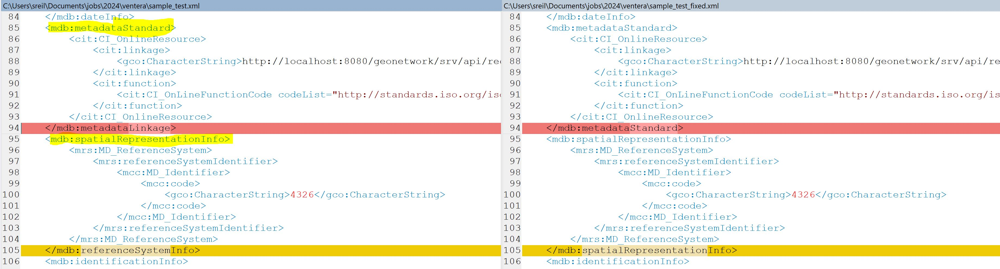
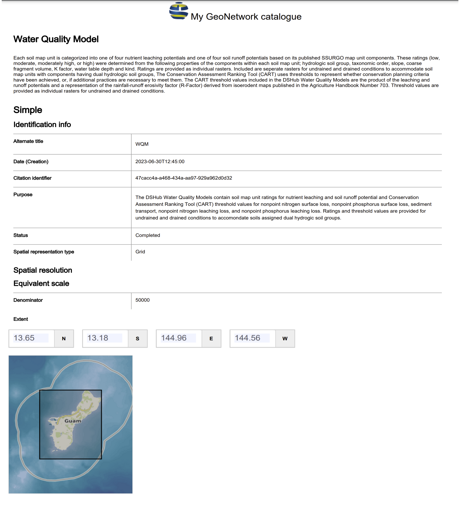
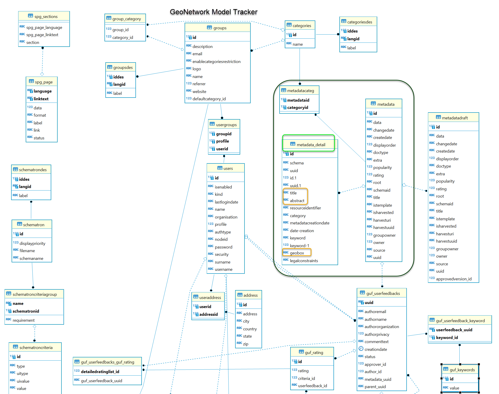

# love_ventera:  
**Postgres/PostGIS and Python code for Ventera Postgres Database Engineer Coding Challenge**

## Challenge 1

#### Environment:

Windows 10 \
pyenv 2.41 with Python 3.12.3 installed and set as default (please feel free to change from Python version in Pipfile) \
QGIS 3.36.2 with bin directory set in %PATH% \
Postgres 13.2 from Enterprise DB \
PostGIS 3.1.1 \
Git (version may not important but with bin directory in %PATH% for access to 'sed' command)

### How to Install and Run

1. Clone the **love_ventera** repository from GitHub:
   ```
   git clone git@github.com:lovegis/love_ventera.git
   ```

2. Change directories to the  **love_ventera** directory:
   ```
   cd love_ventera
   ```

3. Create a virtual environment for **love_ventera**:
   ```bash
   pipenv install --dev
   ``` 

4. Enter the Python Virtual Environment in the **love_ventera** directory:
   ```bash
   pipenv shell
   ``` 

** Note: The command prompt may now show `(love_ventera)` before the prompt (but only tested on 2 OS)

5. We are now ready to configure the database to against our own environments.  This will involve two steps:
* running a shell script to find/replace the passwords 'placeholder' strings with actual passwords - the first being the **postgres** 
  password to the database host that you will run all future against to create objects.  The second is for a new role, **gis_dba**,
  that is a new role that will be created to own all newly created objects.  Below, I am calling this script with simple, not
  secure values that are the same as the role names 'postgres' and 'gis_dba':  \

  In Windows run src\db_passwords.bat:
  ```bash
  src\db_passwords.bat postgres gis_dba
  ```
  In MacOS/linux run src/db_passwords.sh:
  ```bash
  src/db_passwords.sh postgress gis_dba
  ```

* Alter the database HOST and PORT in 2 locations to the host location (IP address or named server) and port number
    * src/love_ventera.sh (lines 4 and 7) \
     
    
    * src/venpy.py (lines 9 and 10) \
     


6. Run a shell script within the `(love_ventera)` virtual environment to run psql commands and python SQLAlchemy commands against the database: \


  In Windows run src\love_ventera_run.sh:
  ```bash
  src\love_ventera_run.sh
  ```
  In MacOS/linux run src/love_ventera_run.sh
  ```bash
  src/love_ventera_run.sh
  ```   

Below is QGIS screenshot with the final table **colorado_county_buffer_lines** (in red):

*****************************************************************************************************************************


## Challenge 2

#### Environment:
Docker Desktop 4.32.0 \
*plus many of the technologies from Challenge 1*

### Discussion of research and issues

The first thing I discovered when verifying the **data\xml\sample_test.xml** was that there were two closing tags that did not match the opening tag.  Thus, I altered the tags to match 
and saved to **data\xml\sample_test_fixed.xml** for processing:
* line 94 (should be the same as 85: mdb:metadataStandard)
* line 105 (should be the same as 95: mdb:spatialRepresentationInfo)



I saw that the first line of the XML referenced **'ISO 19115'** so I started searching for this and **'metadata'** and **'postgres'** and found this [GIS Stack Exchange post](https://gis.stackexchange.com/questions/339816/storing-metadata-in-postgresql)

After reading through a few documents, it appeared to support Postgres and PostGIS so thought I may have found the 'tool' 
to process and represent this XML metadata GIS Model in a Postgres/PostGIS.  I started with an installation file for Windows that was on an older version (3.12), 
but was not able to configure the connection of the Postgres database given the sparce documentation.  Thus, I decided to work with Docker using the Desktop client 
and I was able to successfully get this working with my local Postgres instance.  

After I successfully imported the XML sample, I was very impressed with the PDF file produced, data\images\GeoNetwork_Model_from_sample.pdf. 


Unfortunately, the DB 'metadata' Postgres table upon initial conversion did not offer as much detail and was not spatially aware.  However, I did discover 
a method to output more relevant data including the Title, Abstract, and Geolocation which I loaded into the public.metadata_detail table and created a 
foreign key to the metadata table on **uuid**.  My resultant database model for Challenge 2 is here:

### How to Install and Run Geonetwork using Docker
Edit the HOST and PORT DB connection parameters in src/docker_run.sh and then call from the command line:
```
src\docker_run.sh
```

I look forward to discussing the other technologies (xml2db, xmltoxsd, xml.etree, pandas, etc.) that I attempted (src/xml_model_to_pg.py) to parse this XML for a 
more robust relational model and would love to learn more from the team!